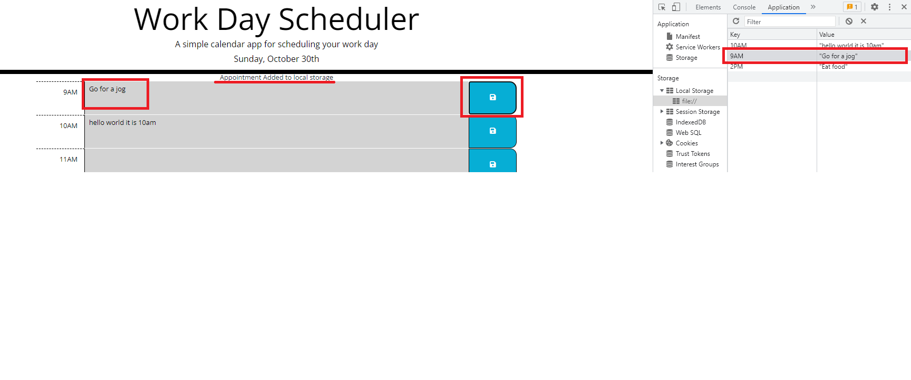

# Work Day Scheduler

## Description

The motivation for this project was to create a Work Day Scheduler while exploring how to use Third-Party APIs. This project uses jQuery and Moment.js to dynamically create the timeblocks listed in the scheduler and to synchronize the app with the real-world date and time. This project automates the time synchronization of the scheduler and displays that information to the user by highlighting past hours as grey, the present hour as red, and future hours as green. By completing this project, I learned how to dynamically assign classes to HTML elements by using jQuery, along with traversing and adding DOM elements to HTML code with jQuery.

## Installation

N/A

## Usage

When first loading this project, the application checks for existing event data in the local storage and adds the stored events to the listed timeblocks in the scheduler.

In the above example, the current hour was set to 2pm, and we can see that the color of the timeblocks has adjusted accordingly. The user can click into any of the timeblocks, edit the event text, and click on the blue save button to the right of the row to save the event in the local storage. The below example updates the 9AM event to "Go for a jog," and we can see that the event is stored in the local storage after saving the event.

The application also generates a notification, confirming that the appointment has been added to the local storage.

## Credits

The floppy disc icon is written by Font Awesome Icons. Their webiste can be found at https://fontawesomeicons.com/.

## License

N/A

## Tests

A user can test the scheduler at specific hours by uncommenting line 46 of script.js and assigning the test value to currentHour. The tested hour should be entered using a its value on 24 hour clock (e.g. 2pm is entered as 14).

